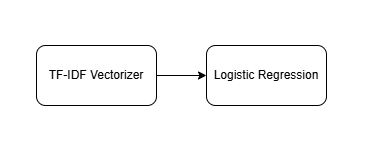
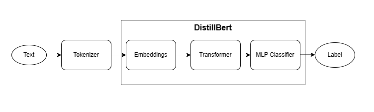

# Introduction

**Task Assignment: Sentiment Classification for Movie Reviews**

This project provide 3 restful endpoints with different approaches(TF-IDF, Bert, LLM) that determines whether a movie review expresses a positive or negative sentiment, the models(except LLM) were trained on "IMDb Dataset of 50K Movie Reviews".
The project is implemented using Python, Scikit-learn, PyTorch, LangChain, and FastAPI, with containerization via Docker.

Deliverables:  
1. The project **source code** under ./src    
2. Unit tests **pytest** under ./tests  
3. Preprocessing, visualization, training precess **jupyter notebooks** under ./z_model_development  
4. A **dockerfile** and **run** instructions in README.md last section  
5. Extra local **api documentation** for easy test ./api_documentation.md (Or run the service and check the **FastAPI auto-gen** doc.)
6. **Bonus** task's conceptual implementations under ./z-bonus  
7. Models were uploaded to **HuggingFace** (https://huggingface.co/protostarss)  
8. After I finished the system, I did **model evaluate** on another dataset and write a short **report** in ./model_evaluation/eval.ipynb

Because the task itself is relatively straightforward, I took the initiative to build a more robust and complete system to showcase my skills. As a result, the number of files in this project increased.  
To make the review process easier, I’ve provided detailed descriptions of each file and my design decisions in **./review_guideline.md.**

# Approach

### **Modeling Architecture:**
> 1. TF-IDF + Logistic Regression(Baseline model)  
> 
> 2. DistilBert + MLP(Transformers)  
> 
> 3. LLM + Structured Output  
> LangChain with **pydantic structured output**

### **Project Architecture:**  
> **Controller Layer**: FastAPI endpoints with request validation and error handling  
> **Service Layer**: Business logic and model inference orchestration  
> **ML Layer**: Three prediction models (TF-IDF+LR, DistilBERT+MLP, LLM)  
> 
> **Folder Structure**:  
> - `api/` - REST endpoints and routing  
> - `services/` - Inference logic and model coordination  
> - `ml/` - ML/DL models (TF-IDF, DistilBERT)  
> - `llm/` - LLM integration and chains  
> - `schema/` - Request/response data models  
> - `utils/` - Logging and utility functions  
> - `exceptions/` - Custom error handling  


# Implementation Steps

1. **Initial Research**

   * Do some online research first. Get a rough idea of potential models and confirm suitable metrics (Accuracy, F1-score, ROC-AUC).

2. **Baseline ML Model**

   * Start with a simple approach: TF-IDF feature extraction + Logistic Regression.

3. **Dataset Familiarization**

   * Read through the dataset briefly. Identify any issues in the raw text data.

4. **Data Cleaning**

   * Clean the dataset to ensure it’s ready for modeling.

5. **Data Visualization**

   * Visualize the dataset clearly to find useful insights and patterns.(I do this after preprocessing for better visualize effect)

6. **Baseline Model Training and Evaluation**

   * Train the baseline model and evaluate it with chosen metrics.

7. **Error Analysis**

   * Analyze errors made by the baseline model. Identify the weaknesses clearly.
   * Plan to use more advanced models (Transformers) to address these issues.

8. **Early API System Implementation**

   * Before training advanced models, set up the API system and create a working demo early:

     * **System Design**: Clearly define endpoints, service layer, ML model layer; ensure scalability, logging, exception handling, and use Pydantic for data validation.
     * **Implementation & Dockerization**: Build the system and containerize it.
     * **Testing**: Conduct unit tests and endpoint tests within Docker.

9. **Advanced Model (DistilBERT + MLP)**

   * Train a DistilBERT + MLP model using PyTorch. Integrate it into the API and test thoroughly.

10. **LLM Approach**

* Implement a LangChain LLM approach with structured output. Add endpoints to the API and test carefully.

11. **Public Data Collection & Testing**

* Collect recent reviews from the internet, use ChatGPT for labeling.
* Test BERT and Baseline model approaches with this new data.
* 

12. **Model Degradation and Data Drift Slide**

* Design and create clear slides describing model degradation and data drift strategies, including detailed descriptions and diagrams.


# How to run the service

## Prerequisites
- Docker installed on your system
- Port 8000 available on your machine
- An openai api key if use the endpoint predict/llm (Optional), add it to .env

## Build and Run Instructions

1. **Change the .env.template file to .env , fill the openai api key(optional)**

2. **Navigate to the project root directory** (where the Dockerfile is located):
   ```bash
   cd /path/to/project/root
   ```

3. **Build the Docker image**:
   ```bash
   docker build -t imdb_sentiment_classify .
   ```

4. **Run the Docker container**:
   ```bash
   docker run --name imdb_sentiment_app -p 8000:8000 imdb_sentiment_classify
   ```

5. **Access the service**:
   - The API will be available at: `http://localhost:8000`
   - FastAPI documentation: `http://localhost:8000/docs`
